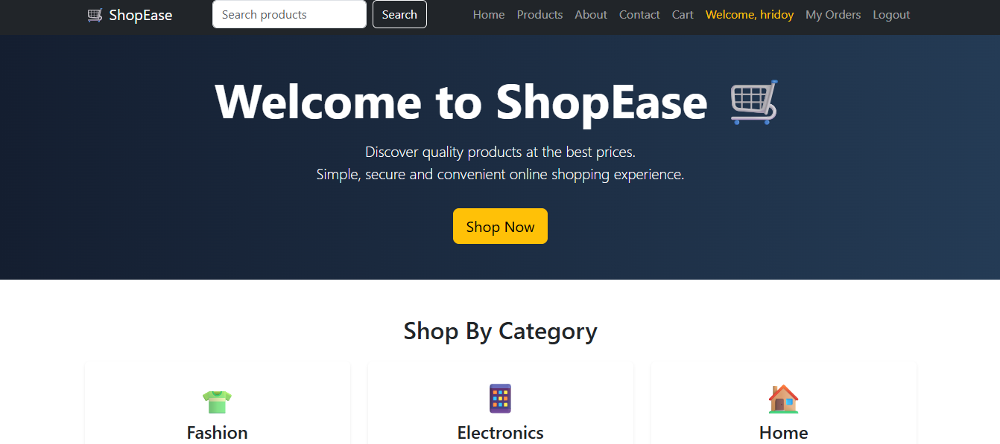

# 🛒 ShopEase - Full-Stack E-Commerce Platform

A full-stack e-commerce web application developed using Django, PostgreSQL, Bootstrap, and Cloudinary. The platform provides a complete online shopping experience with user authentication, product browsing, cart management, checkout system, order tracking, and administrative management.

## 🌐 Live Demo

https://shopease-ecommerce-eb18.onrender.com

## ✨ Features

- User registration and authentication
- Product browsing and category filtering
- Product search functionality
- Product details page
- Shopping cart management
- Checkout and order placement
- Customer order history
- Admin dashboard for product and order management
- Cloudinary-based image storage
- Responsive user interface

## 🛠️ Technologies Used

### Backend
- Python
- Django

### Frontend
- HTML
- CSS
- Bootstrap
- JavaScript

### Database
- PostgreSQL

### Deployment & Services
- Render
- Cloudinary

## 📂 Project Structure
shopease-ecommerce/
│
├── config/
│ ├── settings.py
│ ├── urls.py
│
├── store/
│ ├── models.py
│ ├── views.py
│ ├── urls.py
│
├── templates/
├── static/
├── manage.py
└── requirements.txt

## 🚀 Deployment

The application is deployed using Render with PostgreSQL database integration and Cloudinary for media storage.

## 🔐 Environment Configuration

Sensitive credentials such as Django SECRET_KEY and Cloudinary API credentials are managed using environment variables.

## 📌 Future Improvements

- Online payment gateway integration
- Product recommendation system
- Advanced analytics dashboard
- Customer review and rating system

## 👨‍💻 Author

**Sr Hridoy**

GitHub:  
https://github.com/srhridoy16

## 📸 Screenshots

### 🏠 Home Page

### 🛍️ Product Listing

### 📦 Product Details

### 🛒 Shopping Cart & Checkout

### ⚙️ Admin Dashboard
